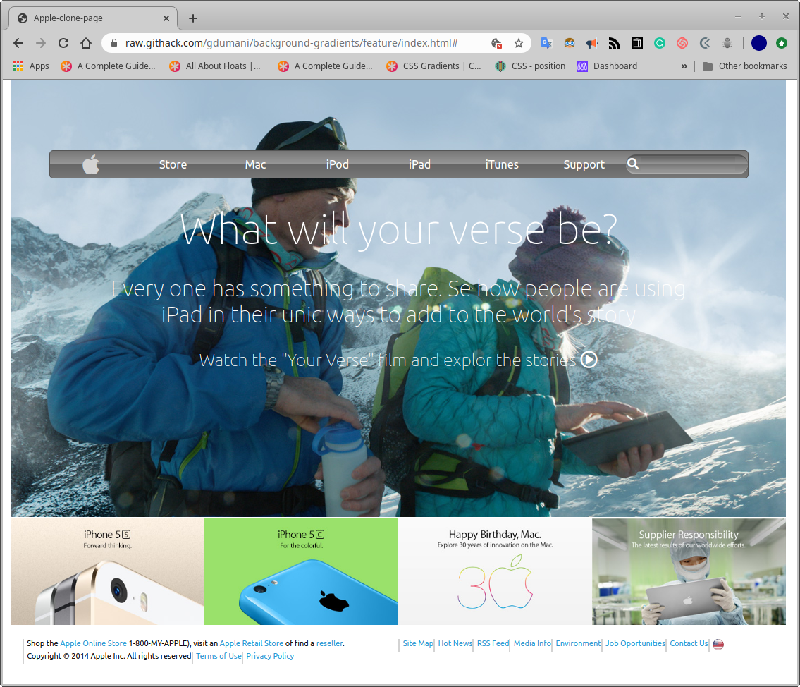

# Apple web page clone
>In this example I created a look-alike web page similar to given example created by Apple.

- CSS linear Gradients were used in the Navbar/
- A picture was used as backgroud.
- Formating was done by using Grids on the Navbar, the bottom pictures and the footer blocks
- Flex was used for the main text and the footer elements inside the block

## Built With

- CSS/HTML
- Flex, Grid, Float layout modes

## Live Demo

[Live Demo Link](https://raw.githack.com/gdumani/background-gradients/feature/index.html)

### Prerequisites
Modern browser
- It was tested on Chrome 80 and Firefox 73

## Authors

👤 **Author1**
Giancarlo Dumani

- Github: [@githubhandle](https://github.com/gdumani
- Twitter: [@twitterhandle](https://twitter.com/gdumani1
- Linkedin: [linkedin](https://www.linkedin.com/in/giancarlo-dumani-a7364a1a1/)

## 🤝 Contributing

Contributions, issues and feature requests are welcome!

Feel free to check the [issues page](issues/).

## Show your support

Give a ⭐️ if you like this project!

## Acknowledgments

- This project was part of Microverse's curriculum in CSS/HTML learning program

## 📝 License

This project is [MIT](lic.url) licensed.
